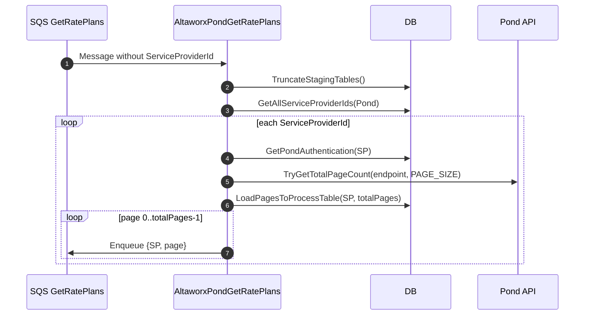
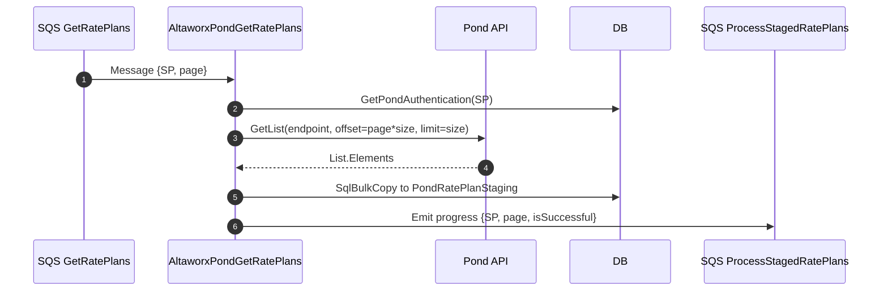

## AltaworxPondGetRatePlans Lambda Flow Documentation

Last updated: 2025-09-19

### Overview

The `AltaworxPondGetRatePlans` Lambda synchronizes rate plan data from the Pond API into the database using a two-phase pattern:
- Initialization: discovers all pages per Service Provider (SP), seeds page markers, and enqueues page work.
- Processing: fetches one page from Pond, stages the data, and signals downstream processing.

It is triggered by SQS events. Messages without a `ServiceProviderId` initiate the initialization flow; messages with a `ServiceProviderId` and `PageNumber` run the page processing flow.

### Architecture at a Glance

```mermaid
flowchart TD
  A[SQS: POND_GET_RATE_PLANS_QUEUE] -->|no ServiceProviderId| B[Lambda: InitializeSyncRatePlansProcess]
  B --> C[Truncate staging tables]
  B --> D[Get all Pond Service Providers]
  D --> E[Get auth per SP]
  E --> F[Try get total page count]
  F --> G[Seed POND_GET_RATE_PLANS_PAGE_TO_PROCESS]
  G --> H[Enqueue page messages]

  A -->|ServiceProviderId + PageNumber| I[Lambda: ProcessSyncPageByServiceProviderId]
  I --> J[Get auth]
  J --> K[Fetch page from Pond (offset=page*size)]
  K --> L[Bulk copy to PondRatePlanStaging]
  L --> M[Emit progress to POND_PROCESS_STAGED_RATE_PLANS_QUEUE]
```

### Environment and Configuration

- **POND_GET_RATE_PLANS_QUEUE_URL**: SQS queue for page work (initialization emits, processing consumes).
- **POND_PROCESS_STAGED_RATE_PLANS_QUEUE_URL**: SQS queue for downstream staging processors.
- **POND_GET_RATE_PLANS_ENDPOINT**: Pond API endpoint (list rate plans).
- **PAGE_SIZE**: Page size when querying the Pond API. Default: `PondHelper.CommonConfig.DEFAULT_PAGE_SIZE`.

Loaded via `TryGetAllEnvironmentVariables()`. Missing required variables should fail fast with clear logs.

### SQS Message Contracts

Queue: `POND_GET_RATE_PLANS_QUEUE_URL`
- Attributes (`SQSMessageKeyConstant`):
  - `SERVICE_PROVIDER_ID` (Number, required for processing mode)
  - `PAGE_NUMBER` (Number, required for processing mode, zero-based)

Queue: `POND_PROCESS_STAGED_RATE_PLANS_QUEUE_URL`
- Attributes (`SQSMessageKeyConstant`):
  - `SERVICE_PROVIDER_ID` (Number, required)
  - `PAGE_NUMBER` (Number, required)
  - `IS_SUCCESSFUL` (String/Boolean-like, required) — indicates success of page processing

Example (Get Rate Plans page work message):
```json
{
  "MessageAttributes": {
    "SERVICE_PROVIDER_ID": { "DataType": "Number", "StringValue": "1234" },
    "PAGE_NUMBER": { "DataType": "Number", "StringValue": "0" }
  },
  "MessageBody": "{}"
}
```

Example (Downstream progress message):
```json
{
  "MessageAttributes": {
    "SERVICE_PROVIDER_ID": { "DataType": "Number", "StringValue": "1234" },
    "PAGE_NUMBER": { "DataType": "Number", "StringValue": "0" },
    "IS_SUCCESSFUL": { "DataType": "String", "StringValue": "true" }
  },
  "MessageBody": "{}"
}
```

### Database Objects

- `DatabaseTableNames.PondRatePlanStaging`
  - Bulk-load target for page data.
  - Expected columns: `Id`, `Name`, `Code`, `Description`, `Status`, `CreatedDate`, `ServiceProviderId`.

- `DatabaseTableNames.POND_GET_RATE_PLANS_PAGE_TO_PROCESS`
  - Tracks page markers per SP for orchestration and progress.
  - Expected columns: `ServiceProviderId`, `PageNumber`.

Staging reset occurs at initialization via `TruncateStagingTables`.

---

## High-Level Flow (Sequential)

1) Main entry: `FunctionHandler(SQSEvent sqsEvent, ILambdaContext context)`
2) If message has no valid `ServiceProviderId`: `InitializeSyncRatePlansProcess(context, serviceProviderRepository)`
3) Else: `ProcessSyncPageByServiceProviderId(context, sqsValues)`

---

## Method-by-Method Documentation

### FunctionHandler (Main Entry Point)

- Signature: `Task FunctionHandler(SQSEvent sqsEvent, ILambdaContext context)`
- Purpose: Orchestrates the Lambda execution for each SQS record; routes to initialization or processing.
- Inputs:
  - `SQSEvent sqsEvent`: Batch of SQS messages.
  - `ILambdaContext context`: AWS Lambda context.
- Dependencies:
  - `AwsFunctionBase` (for logging, DB, cleanup)
  - `EnvironmentRepository` via `TryGetAllEnvironmentVariables()`
  - `GetMessageValues()` to parse per-message attributes
- Behavior:
  1. Initialize `AmopLambdaContext` via `BaseAmopFunctionHandler()`.
  2. Load environment variables: `POND_GET_RATE_PLANS_QUEUE_URL`, `POND_PROCESS_STAGED_RATE_PLANS_QUEUE_URL`, `POND_GET_RATE_PLANS_ENDPOINT`, `PAGE_SIZE`.
  3. Iterate SQS records:
     - Log diagnostics (message id, attributes).
     - Parse `SqsValues` using `GetMessageValues()`.
     - If `ServiceProviderId` missing or <= 0: call `InitializeSyncRatePlansProcess()`.
     - Else: call `ProcessSyncPageByServiceProviderId()`.
  4. Handle exceptions per message; ensure `CleanUp()` is called.
- Errors & Handling:
  - Missing required env vars: log error and fail the batch or message.
  - Malformed attributes: log and skip/flag message; do not proceed to processing.
  - Always ensure `Dispose/Cleanup` of resources.

Pseudo-code:
```csharp
foreach (var record in sqsEvent.Records)
{
    var values = GetMessageValues(record);
    if (values.ServiceProviderId <= 0)
        await InitializeSyncRatePlansProcess(context, serviceProviderRepository);
    else
        await ProcessSyncPageByServiceProviderId(context, values);
}
```

### InitializeSyncRatePlansProcess (Initialization Mode)

- Signature: `Task InitializeSyncRatePlansProcess(AmopLambdaContext context, ServiceProviderRepository serviceProviderRepository)`
- Purpose: Seed page work for all Pond Service Providers and fan out SQS page messages.
- Dependencies:
  - `PondRepository` for `TruncateStagingTables` and `GetPondAuthentication`
  - `ServiceProviderRepository` for `GetAllServiceProviderIds(IntegrationType.Pond)`
  - `PondApiService` for `TryGetTotalPageCount<T>` using `POND_GET_RATE_PLANS_ENDPOINT`
  - `LoadPagesToProcessTable`
  - `InitGetRatePlansPages`
- Behavior:
  1. `TruncateStagingTables()` to reset `PondRatePlanStaging` and related staging.
  2. Get SP ids: `GetAllServiceProviderIds(IntegrationType.Pond)`.
  3. For each `serviceProviderId`:
     - Get auth: `GetPondAuthentication(serviceProviderId)`.
     - Determine `totalPages`: `TryGetTotalPageCount` against `POND_GET_RATE_PLANS_ENDPOINT` with `PAGE_SIZE`.
     - Persist page markers: `LoadPagesToProcessTable(context, serviceProviderId, totalPages)`.
     - Enqueue each page [0..totalPages-1]: `InitGetRatePlansPages(context, serviceProviderId, page)` to `POND_GET_RATE_PLANS_QUEUE_URL`.
- Edge Cases:
  - `totalPages == 0`: seed no work; log info.
  - Auth missing/invalid: log and continue/skip SP depending on policy.
  - API transient errors: rely on service-level retries when fetching page count.

### ProcessSyncPageByServiceProviderId (Processing Mode)

- Signature: `Task ProcessSyncPageByServiceProviderId(AmopLambdaContext context, SqsValues sqsValues)`
- Purpose: Fetch one page of rate plans for the requested SP and stage results.
- Inputs:
  - `sqsValues.ServiceProviderId` (required)
  - `sqsValues.PageNumber` (required)
- Dependencies:
  - `PondRepository` for auth
  - `PondApiService` for list calls
  - `RetryPolicyHelper` for SQL transient retry policy
  - `SyncRatePlans`
- Behavior:
  1. Retrieve `Pond` auth for `ServiceProviderId`.
  2. Create `PondApiService` client.
  3. Call `SyncRatePlans(context, sqsValues, sqlTransientRetryPolicy, pondApiService)`.

### SyncRatePlans

- Signature: `Task SyncRatePlans(AmopLambdaContext context, SqsValues sqsValues, IAsyncPolicy sqlTransientRetryPolicy, PondApiService pondApiService)`
- Purpose: Orchestrate one-page fetch, stage load, and downstream progress signal.
- Steps:
  1. Fetch page list via `GetSinglePageListFromPondAPIAsync<PondRatePlanItem, PondRatePlanListResponse>`.
  2. Transform and `LoadRatePlansToStagingTable(context, serviceProviderId, items)` via bulk copy.
  3. On success, call `CheckSyncRatePlansStepProgress(context, sqsValues, isSuccessful: true)`.
  4. On error, log, optionally retry per `sqlTransientRetryPolicy`, and emit `isSuccessful: false`.
- Notes:
  - Page size from env; offset = `PageNumber * PageSize` (zero-based).
  - Emitting progress is important to unblock downstream processing.

### GetSinglePageListFromPondAPIAsync<TItem, TList>

- Signature: `Task<IReadOnlyList<TItem>> GetSinglePageListFromPondAPIAsync<TItem, TList>(AmopLambdaContext context, PondApiService svc, string endpoint, int pageNumber, int pageSize)`
- Purpose: Retrieve a single page of items from Pond.
- Behavior:
  - Compute `offset = pageNumber * pageSize`.
  - Invoke `svc.GetPondListAsync<TList>(HttpClientSingleton.Instance, endpoint, offset, pageSize)`.
  - Extract `IEnumerable<TItem>` via `response => response.Elements`.
  - Return an empty list when no elements; never return null.
- Errors & Handling:
  - Transient HTTP failures: rely on internal HTTP retry/backoff if configured; otherwise bubble up.
  - Validation: ensure `pageNumber >= 0` and `pageSize > 0`.

### LoadRatePlansToStagingTable

- Signature: `Task LoadRatePlansToStagingTable(AmopLambdaContext context, int serviceProviderId, IEnumerable<PondRatePlanItem> items)`
- Purpose: Bulk load transformed items into `PondRatePlanStaging`.
- Behavior:
  - Build a `DataTable` with columns: `Id`, `Name`, `Code`, `Description`, `Status`, `CreatedDate`, `ServiceProviderId`.
  - Populate rows from `items`, setting `ServiceProviderId` for each row.
  - Execute `SqlBulkCopy` into `DatabaseTableNames.PondRatePlanStaging` using `AwsFunctionBase` helpers.
- Notes:
  - Ensure types match DB schema (e.g., timestamps, string lengths).
  - Consider chunking very large batches if required by DB limits.

### LoadPagesToProcessTable

- Signature: `Task LoadPagesToProcessTable(AmopLambdaContext context, int serviceProviderId, int totalPages)`
- Purpose: Seed per-page markers for orchestration and progress tracking.
- Behavior:
  - Build a `DataTable` with columns: `ServiceProviderId`, `PageNumber` for each page in `[0, totalPages)`.
  - Bulk insert using `SqlBulkCopy` into `DatabaseTableNames.POND_GET_RATE_PLANS_PAGE_TO_PROCESS`.

### InitGetRatePlansPages

- Signature: `Task InitGetRatePlansPages(AmopLambdaContext context, int serviceProviderId, int pageNumber)`
- Purpose: Enqueue a single SQS message for page processing.
- Behavior:
  - Publish to `POND_GET_RATE_PLANS_QUEUE_URL` with attributes:
    - `SERVICE_PROVIDER_ID`
    - `PAGE_NUMBER`
  - Use `SqsService` publishing helpers; set non-interactive flags and appropriate delay as needed.

### CheckSyncRatePlansStepProgress

- Signature: `Task CheckSyncRatePlansStepProgress(AmopLambdaContext context, SqsValues sqsValues, bool isSuccessful)`
- Purpose: Notify downstream processors that a page has been staged (or failed) for `ServiceProviderId` + `PageNumber`.
- Behavior:
  - Publish to `POND_PROCESS_STAGED_RATE_PLANS_QUEUE_URL` with attributes:
    - `SERVICE_PROVIDER_ID`
    - `PAGE_NUMBER`
    - `IS_SUCCESSFUL`
  - Downstream services can use repository methods (e.g., `UpdateRatePlansPageStatusAndCheckSyncProgress`) to advance overall sync state.

### GetMessageValues

- Signature: `SqsValues GetMessageValues(SQSMessage message)`
- Purpose: Parse and validate SQS message attributes.
- Behavior:
  - Read `SERVICE_PROVIDER_ID`, `PAGE_NUMBER`, and optional `IS_SUCCESSFUL`.
  - Convert to appropriate types; default `IS_SUCCESSFUL` if absent.
  - Return structured `SqsValues` with validation flags.
- Errors & Handling:
  - Missing required attributes for processing mode: route to initialization or log/drop.

### TryGetAllEnvironmentVariables

- Signature: `bool TryGetAllEnvironmentVariables(out EnvValues envValues, ILogger logger)`
- Purpose: Load and validate environment variables.
- Behavior:
  - Read `POND_GET_RATE_PLANS_QUEUE_URL`, `POND_PROCESS_STAGED_RATE_PLANS_QUEUE_URL`, `POND_GET_RATE_PLANS_ENDPOINT`, `PAGE_SIZE`.
- Notes:
  - `PAGE_SIZE` defaults to `PondHelper.CommonConfig.DEFAULT_PAGE_SIZE` when unset.
  - Log sanitized values for diagnostics (avoid secrets).

### InitializeRepositories

- Purpose: Create repository instances via shared DB connection string.
- Behavior:
  - Use `CentralDbConnectionString` from configuration.
  - Instantiate `PondRepository` and `ServiceProviderRepository`.

### External/Infrastructure Dependencies

- `AwsFunctionBase`: logging, configuration, DB helpers (bulk copy), cleanup.
- `PondRepository`: Pond sync DB CRUD, staging, progress updates, and auth retrieval.
- `ServiceProviderRepository`: Enumerates service providers and related metadata.
- `PondApiService`: Performs Pond list API calls; constructs query params (`offset`, `limit`).
- `SqsService`: Publishes SQS messages to the designated queues.
- `RetryPolicyHelper`: Provides retry policies for transient SQL/HTTP failures.
- `HttpClientSingleton` and `HttpRequestFactory`: Efficient HTTP client reuse and request construction.

---

## Detailed Flows

### Initialization Flow (no ServiceProviderId present)



### Processing Flow (ServiceProviderId present)



---

## Error Handling, Retries, and Idempotency

- HTTP/API errors: handled by `PondApiService` retry policies if configured; otherwise surfaced to Lambda to retry via SQS redrive.
- SQL transient errors: guard critical DB operations with `RetryPolicyHelper`.
- SQS visibility: ensure message processing is idempotent; bulk copy into staging is safe because staging is reset at initialization and can tolerate duplicates during retry (design-dependent).
- Missing auth or SP misconfiguration: log and skip or mark as failed; do not block other SPs.
- Partial failures: always emit progress with `IS_SUCCESSFUL=false` to allow downstream compensations.

---

## Observability

- Logging:
  - Message diagnostics (message id, SP, page, offsets, sizes).
  - API calls (endpoint, offset, pageSize, duration).
  - Bulk copy (row counts, duration).
  - Progress emission (queue, attributes).
- Metrics (suggested):
  - `RatePlans.PagesEnqueued`, `RatePlans.PagesProcessed`, `RatePlans.RowsStaged`.
  - `RatePlans.PageLatencyMs` (API + DB), `RatePlans.Failures` by stage.
- Alarms:
  - High `ApproximateAgeOfOldestMessage` on either queue.
  - Elevated failure counts or DLQ activity.

---

## Operational Notes

- Page Numbering: zero-based. Offset = `pageNumber * pageSize`.
- Capacity Planning: ensure Lambda concurrency aligns with SQS message volume and DB throughput.
- Permissions:
  - SQS: SendMessage (both queues), Receive/DeleteMessage (get queue), GetQueueAttributes.
  - Secrets/Params for DB connection and Pond credentials as applicable.
  - Network access to Pond API and DB.
- Timeouts and Batching:
  - Keep per-page work within Lambda timeout; adjust `PAGE_SIZE` accordingly.
  - Consider partial staging commit sizes if rows per page are very large.

---

## Appendix: Pseudocode Sketches

Initialization (per SP):
```csharp
var totalPages = await pondApi.TryGetTotalPageCount(endpoint, pageSize);
await LoadPagesToProcessTable(ctx, spId, totalPages);
for (var p = 0; p < totalPages; p++)
{
    await InitGetRatePlansPages(ctx, spId, p);
}
```

Processing (single page):
```csharp
var items = await GetSinglePageListFromPondAPIAsync<PondRatePlanItem, PondRatePlanListResponse>(ctx, api, endpoint, page, pageSize);
await LoadRatePlansToStagingTable(ctx, spId, items);
await CheckSyncRatePlansStepProgress(ctx, values, isSuccessful: true);
```

---

## Glossary

- SP: Service Provider
- Staging: Transitional data store prior to final processing/loading
- Page Marker: DB row in `POND_GET_RATE_PLANS_PAGE_TO_PROCESS` representing one work unit
